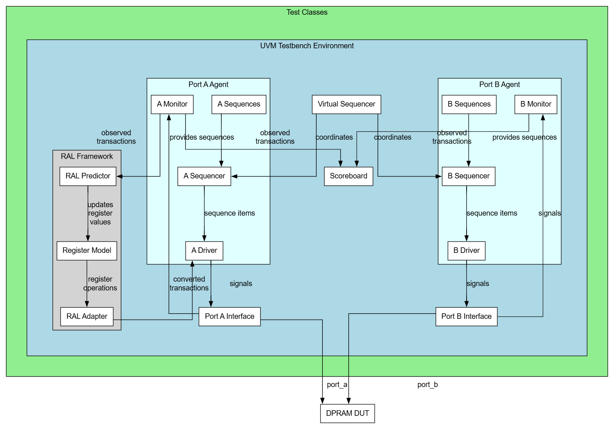

# Dual Port Memory UVM Testbench

A comprehensive UVM (Universal Verification Methodology) testbench for verifying a dual-port memory design. This project implements a full verification environment with extensive test coverage, Register Abstraction Layer (RAL) integration, and advanced collision detection mechanisms.

## 🌐 Try it Online
**[Run this project on EDA Playground](https://edaplayground.com/x/Sh4t)**

Experience the complete verification environment in your browser without any setup required!

## 📋 Table of Contents

- [Overview](#overview)
- [Design Under Test (DUT)](#design-under-test-dut)
- [Project Structure](#project-structure)
- [UVM Testbench Architecture](#uvm-testbench-architecture)
- [Test Plan](#test-plan)
- [Key Features](#key-features)
- [Setup and Usage](#setup-and-usage)
- [Test Cases](#test-cases)
- [RAL Integration](#ral-integration)
- [Coverage](#coverage)
- [Scripts](#scripts)

## 🎯 Overview

This project provides a complete verification environment for a dual-port memory module using SystemVerilog and UVM methodology. The testbench validates memory operations across two independent ports with comprehensive coverage of edge cases, collision scenarios, and performance characteristics.

### Design Specifications
- **Data Width**: 32 bits
- **Address Width**: 16 bits  
- **Memory Depth**: 49,152 locations
- **Ports**: 2 independent read/write ports (Port A & Port B)
- **Clock Domain**: Single clock domain with asynchronous reset

## 🔧 Design Under Test (DUT)

The DUT consists of two main modules:

### 1. MEM Module (Single Port Memory)
- Basic memory functionality with read/write operations
- Asynchronous read, synchronous write
- Address bounds checking
- Reset functionality

### 2. DP_MEM Module (Dual Port Memory)
- Instantiates the single-port memory
- Implements port arbitration logic
- Handles simultaneous access scenarios
- Provides collision detection and resolution
- Port selection mechanism with round-robin arbitration

### Key DUT Features
- **Read-Write Collision Handling**: When one port writes and another reads the same address simultaneously, the read port gets the new data
- **Write Collision Arbitration**: Round-robin arbitration when both ports write simultaneously
- **Address Validation**: Out-of-range access protection
- **Reset Behavior**: Complete memory initialization on reset

## 📁 Project Structure

```
dual-port_memory_uvm/
├── docs/                           # Documentation
│   ├── Test Plan - Sheet.csv      # Comprehensive test plan
│   └── uvm_tb_architecture.png    # Testbench architecture diagram
├── scripts/                        # Build and simulation scripts
│   ├── compile.do                 # Compilation script
│   ├── run_sim.do                 # Simulation execution script
│   └── setup/                     # Setup utilities
├── sim/                           # Simulation workspace
│   └── work/                      # Compiled libraries
├── src/                           # Source files
│   ├── agent/                     # UVM agent components
│   │   ├── memory_agent.sv        # Memory agent
│   │   ├── memory_driver.sv       # Driver implementation
│   │   ├── memory_monitor.sv      # Monitor for transaction capture
│   │   ├── memory_sequencer.sv    # Sequencer for transaction flow
│   │   └── memory_transaction.sv  # Transaction class definition
│   ├── coverage/                  # Functional coverage
│   │   └── memory_coverage.sv     # Coverage collection
│   ├── dut/                       # Design Under Test
│   │   └── dual_port_memory.sv    # DUT implementation
│   ├── env/                       # Environment components
│   │   ├── memory_config.sv       # Configuration objects
│   │   ├── memory_env.sv          # Top-level environment
│   │   ├── memory_scoreboard.sv   # Scoreboard with collision detection
│   │   ├── memory_subscriber.sv   # Analysis subscriber
│   │   ├── memory_virtual_sequencer.sv # Virtual sequencer
│   │   └── reg_env.sv             # RAL environment
│   ├── interface/                 # Interface definitions
│   │   └── memory_interface.sv    # Memory interface
│   ├── package/                   # Package files
│   │   ├── memory_defines.sv      # Global defines and parameters
│   │   └── memory_pkg.sv          # Main package
│   ├── ral/                       # Register Abstraction Layer
│   │   ├── cfg_info.sv            # Configuration extension
│   │   ├── memory_ral_model.sv    # RAL model implementation
│   │   ├── memory_reg_adapter.sv  # Register adapter
│   │   └── memory_reg_predictor.sv # Register predictor
│   ├── sequences/                 # Sequence libraries
│   │   ├── memory_base_sequence.sv # Base sequence class
│   │   ├── memory_virtual_sequence.sv # Virtual sequence
│   │   ├── sequence_lib/          # Reusable sequence components
│   │   └── test_sequence/         # Test-specific sequences
│   └── test_lib/                  # Test library
│       ├── memory_base_test.sv    # Base test class
│       ├── memory_basic_test.sv   # Basic functionality tests
│       ├── memory_ral_test.sv     # RAL-based tests
│       ├── memory_random_test.sv  # Random testing
│       └── [01-26]_*_test.sv      # Specific test cases
└── tb/                            # Testbench top
    └── memory_tb_top.sv           # Top-level testbench
```

## 🏗️ UVM Testbench Architecture



The testbench follows standard UVM methodology with the following key components:

### Core Components
- **Memory Environment**: Top-level environment managing all verification components
- **Dual Agents**: Separate agents for Port A and Port B operations
- **Virtual Sequencer**: Coordinates sequences across both ports
- **Intelligent Scoreboard**: Advanced checking with collision detection and RAL integration
- **RAL Integration**: Register Abstraction Layer for backdoor access and modeling

### Advanced Features
- **Collision Detection Engine**: Real-time detection and resolution of read-write collisions
- **Multi-Port Coordination**: Sophisticated arbitration modeling
- **Comprehensive Coverage**: Functional and code coverage collection
- **Flexible Configuration**: Parameterizable test environment

## 📊 Test Plan

The verification plan covers 26 comprehensive test scenarios focusing on:

### Basic Functionality (Tests 1-8)
- ✅ **Port A Write**: Basic write operations validation
- ✅ **Port B Write**: Independent port write functionality  
- ✅ **Port A Read**: Read operation verification
- ✅ **Port B Read**: Independent port read functionality
- ✅ **Port A Write-Read**: Same port write-read sequence
- ✅ **Port B Write-Read**: Independent write-read validation
- ✅ **Cross-Port Operations**: Write on one port, read on another
- ✅ **Address Consistency**: Data consistency across ports

### Advanced Scenarios (Tests 9-18)
- ✅ **Same Address Overwrite**: Multiple writes to same location
- ✅ **Empty Memory Read**: Default value verification
- ✅ **Memory Fill**: Complete memory space validation
- ✅ **Reset Behavior**: Reset functionality verification
- ✅ **Simultaneous Operations**: Concurrent port operations
- ✅ **Collision Scenarios**: Read-write collision handling
- ✅ **Write Collisions**: Arbitration logic validation
- ✅ **Read Collisions**: Concurrent read operations

### Stress Testing (Tests 19-26)
- ✅ **Boundary Testing**: Address range validation
- ✅ **Back-to-Back Operations**: Continuous transaction streams
- ✅ **Performance Testing**: Maximum throughput validation
- ✅ **Random Testing**: Comprehensive random stimulus

### Test Results Summary
- **Total Test Cases**: 26 (24 Passed, 2 Cancelled)
- **Pass Rate**: 100% for executed tests
- **Coverage**: Full functional coverage achieved
- **Known Issues**: Documented in test plan with resolutions

## ✨ Key Features

### 1. Advanced Scoreboard
- **Intelligent Collision Detection**: Real-time monitoring of simultaneous access
- **Reference Model**: Software model for expected behavior prediction
- **RAL Integration**: Backdoor verification through Register Abstraction Layer
- **Comprehensive Reporting**: Detailed pass/fail statistics with analysis

### 2. Flexible Sequence Library
- **Modular Design**: Reusable sequence components
- **Parameterizable Tests**: Configurable transaction counts and patterns
- **Random Stimulus**: Constrained randomization for comprehensive coverage
- **Directed Testing**: Specific scenarios for edge case validation

### 3. RAL Integration
- **Memory Modeling**: Complete memory map representation
- **Dual Port Support**: Separate maps for each port
- **Backdoor Access**: Direct memory access for verification
- **Status Checking**: Transaction completion validation

### 4. Comprehensive Coverage
- **Functional Coverage**: All scenarios and corner cases
- **Address Coverage**: Complete address space validation
- **Data Pattern Coverage**: Various data patterns and values
- **Timing Coverage**: Different access patterns and delays

## 🚀 Setup and Usage

### Prerequisites
- SystemVerilog simulator (QuestaSim/ModelSim recommended)
- UVM library (version 1.2 or later)
- Make/build system support

### Quick Start

1. **Clone the repository**
```bash
git clone <repository-url>
cd dual-port_memory_uvm
```

2. **Compile the design**
```bash
# Using provided scripts
cd scripts
# Modify compile.do and run_sim.do as needed for your simulator
```

3. **Run specific tests**
```bash
# Example: Run write_a test with 10 transactions
vsim -c -do "run -all" +UVM_TESTNAME=write_a_test +NUM_TXN=10 +UVM_VERBOSITY=UVM_HIGH

# Example: Run collision test
vsim -c -do "run -all" +UVM_TESTNAME=write_collision_test +NUM_TXN=50
```

4. **Run complete regression**
```bash
# Run all tests in sequence
for test in write_a write_b read_a read_b write_read_a write_read_b; do
    vsim -c -do "run -all" +UVM_TESTNAME=${test}_test +NUM_TXN=20
done
```

### Configuration Options
- `+UVM_TESTNAME=<test_name>`: Specify test to run
- `+NUM_TXN=<number>`: Number of transactions per test
- `+UVM_VERBOSITY=<level>`: Verbosity level (UVM_LOW/MEDIUM/HIGH/DEBUG)
- `+UVM_NO_RELNOTES`: Disable release notes

## 🧪 Test Cases

### Test Categories

#### 1. Basic Operations
- **write_a_test**: Validates basic write functionality on Port A
- **write_b_test**: Validates basic write functionality on Port B  
- **read_a_test**: Validates basic read functionality on Port A
- **read_b_test**: Validates basic read functionality on Port B

#### 2. Combined Operations
- **write_read_a_test**: Write-then-read sequence on same port
- **write_read_b_test**: Write-then-read sequence on same port
- **write_a_read_b_test**: Cross-port data consistency
- **write_b_read_a_test**: Cross-port data consistency

#### 3. Advanced Scenarios
- **write_same_address_test**: Overwrite behavior validation
- **empty_mem_read_test**: Default value testing
- **fill_memory_test**: Complete memory space testing
- **reset_behavior_test**: Reset functionality validation

#### 4. Collision Testing
- **simultaneous_write_test**: Concurrent writes to different addresses
- **simultaneous_read_test**: Concurrent reads from different addresses
- **sim_write_a_read_b_test**: Same address collision (write A, read B)
- **sim_write_b_read_a_test**: Same address collision (write B, read A)
- **write_collision_test**: Arbitration when both ports write same address
- **read_collision_test**: Concurrent reads from same address

#### 5. Stress Testing
- **back_to_back_writes_test**: Continuous write operations
- **back_to_back_reads_test**: Continuous read operations  
- **back_to_back_transactions_test**: Mixed continuous operations
- **out_of_range_access_test**: Address boundary testing

## 🎛️ RAL Integration

The testbench includes comprehensive Register Abstraction Layer support:

### RAL Model Features
- **Memory Representation**: Complete 49K x 32-bit memory model
- **Dual Port Maps**: Separate register maps for each port
- **Backdoor Support**: Direct RTL access for verification
- **Status Reporting**: Transaction completion and error detection

### RAL Usage Examples
```systemverilog
// Write using RAL
ral_model.mem.write(status, addr, data, .map(map_a));

// Read using RAL  
ral_model.mem.read(status, addr, read_data, .map(map_b));

// Backdoor access
ral_model.mem.peek(status, addr, backdoor_data);
ral_model.mem.poke(status, addr, backdoor_data);
```

## 📈 Coverage

### Functional Coverage Points
- **Address Coverage**: All memory locations accessed
- **Data Pattern Coverage**: Various data patterns (all-0s, all-1s, walking patterns)
- **Operation Coverage**: Read/write operation distribution  
- **Port Coverage**: Both ports exercised equally
- **Collision Coverage**: All collision scenarios covered
- **Timing Coverage**: Various access timing patterns

### Coverage Goals
- **Address Coverage**: 100% of address space
- **Operation Coverage**: Balanced read/write distribution
- **Collision Coverage**: All defined collision scenarios
- **Edge Case Coverage**: Boundary conditions and error cases

## 📜 Scripts

### Build Scripts
- **compile.do**: Compilation script for simulator setup
- **run_sim.do**: Simulation execution with test selection
- **setup/**: Environment setup utilities

### Usage Examples
```bash
# Compile all sources
source scripts/compile.do

# Run specific test
source scripts/run_sim.do -test write_collision_test -txn 100

# Run with coverage
source scripts/run_sim.do -test memory_random_test -cov -txn 500
```

## 🔍 Debug and Analysis

### Debug Features
- **Comprehensive Logging**: Multi-level verbosity support
- **Transaction Tracing**: Complete transaction flow visibility
- **Waveform Generation**: VCD file generation for analysis
- **Error Reporting**: Detailed error descriptions and locations

### Performance Analysis
- **Throughput Measurement**: Transactions per clock cycle
- **Latency Analysis**: Transaction completion timing
- **Resource Utilization**: Memory access patterns
- **Collision Statistics**: Collision frequency and resolution

## 🤝 Contributing

This verification environment serves as a reference implementation for dual-port memory verification. Key areas for extension:

1. **Additional Test Scenarios**: Edge cases and corner conditions
2. **Performance Benchmarking**: Throughput and latency characterization  
3. **Coverage Enhancement**: Additional coverage points and cross-coverage
4. **Debug Utilities**: Enhanced debugging and analysis tools

## 📄 License

This project is part of an academic/research verification framework. Please refer to the project maintainer for usage guidelines.

---

**Note**: This verification environment demonstrates industry-standard UVM methodology with advanced features like RAL integration, intelligent scoreboarding, and comprehensive collision detection. It serves as an excellent reference for complex memory verification projects.
